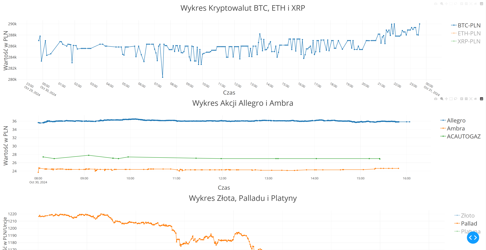

# Asset Monitoring Dashboard

** Asset Monitoring Dashboard** to dashboard do monitorowania cen kryptowalut, akcji oraz cen metali szlachetnych w czasie rzeczywistym. Zbudowany z użyciem Pythona, Dash oraz różnych API finansowych, dashboard pobiera i wyświetla aktualne ceny aktywów, wizualizując je w przystępny sposób.



## Funkcje

- **Śledzenie Kryptowalut:** Wyświetla aktualne dane dla Bitcoin (BTC), Ethereum (ETH) i Ripple (XRP) w PLN.
- **Ceny Akcji:** Monitoruje ceny akcji Allegro, Ambra i ACAUTOGAZ w czasie rzeczywistym.
- **Metale Szlachetne:** Śledzi wartości złota, palladu i platyny.
- **Automatyczne Odświeżanie:** Aktualizuje dane co godzinę, aby pokazać bieżące ceny.

## Struktura Projektu

- `main.py`: Inicjuje i uruchamia dashboard.
- `data_manager.py`: Zawiera klasę `DataManager`, która pobiera i przetwarza dane z różnych API (Zonda Crypto, GPW, Bankier).
- `plot_manager.py`: Zawiera klasę `PlotManager` odpowiedzialną za tworzenie wykresów dla kryptowalut, akcji i metali.
- `dashboard.py`: Definiuje układ i funkcje aktualizacji danych w czasie rzeczywistym przy użyciu Dash.

## Instalacja

1. **Sklonuj Repozytorium:**
   ```bash
   git clone https://github.com/yourusername/BreadcrumbsAsset-Monitoring-Dashboard.git
   cd BreadcrumbsAsset-Monitoring-Dashboard
   ```

2. **Zainstaluj Wymagane Biblioteki:**
   ```bash
   pip install -r requirements.txt
   ```

3. **Uruchom Dashboard:**
   ```bash
   python main.py
   ```

## Użycie

Po uruchomieniu, dashboard będzie dostępny pod adresem `http://127.0.0.1:8050` w przeglądarce internetowej. Wykresy dla każdej klasy aktywów będą odświeżane co godzinę.
